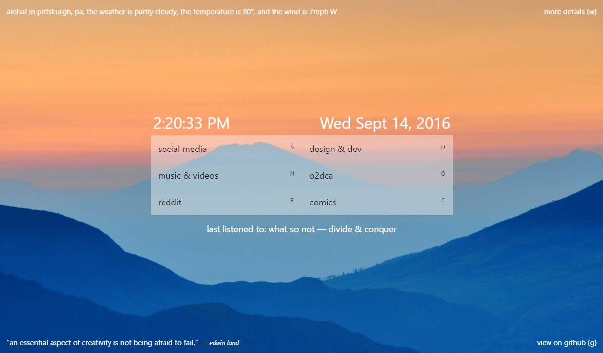

# start [https://pschfr.github.io/start/](https://pschfr.github.io/start/)

##Personal new tab page with keyboard navigation, bookmarks, weather, quote, most recently listened to song, and image background.

##Features:
- Background is a random nature photo that changes daily from [Unsplash Source](https://source.unsplash.com/)
- Weather is [powered by Dark Sky!](https://darksky.net/poweredby/)
- Keyboard navigation is thanks to [ccampbell/mousetrap](https://github.com/ccampbell/mousetrap)!
- Random inspirational quote!
- Most recently listened to song thanks to my Last.FM script [pschfr/LastFM.js](https://github.com/pschfr/LastFM.js)!

Each category can open by keyboard and click, press escape or click background to close all.

###You need extensions for most browsers to use this as your new tab page:
- [New Tab Redirect for Chrome](https://chrome.google.com/webstore/detail/new-tab-redirect/icpgjfneehieebagbmdbhnlpiopdcmna)
	- You can also go to chrome://extensions, tick Developer Mode, and Load as unpacked extension for faster loading.
- [New Tab Override for Firefox](https://addons.mozilla.org/en-US/firefox/addon/new-tab-override/)
- [Custom New Tab Page for Opera](https://addons.opera.com/en/extensions/details/custom-new-tab-page/)
- Safari - just set it as your homepage in settings.

Browse similar style pages on [/r/startpages](https://reddit.com/r/startpages).

It's super fast. Fully loaded at ~300ms (~150ms as an extension!!) :D

Feel free to fork, and add your own bookmarks and quotes!

If you have any questions, [tweet me](http://twitter.com/pschfr) or file an issue or pull request.
